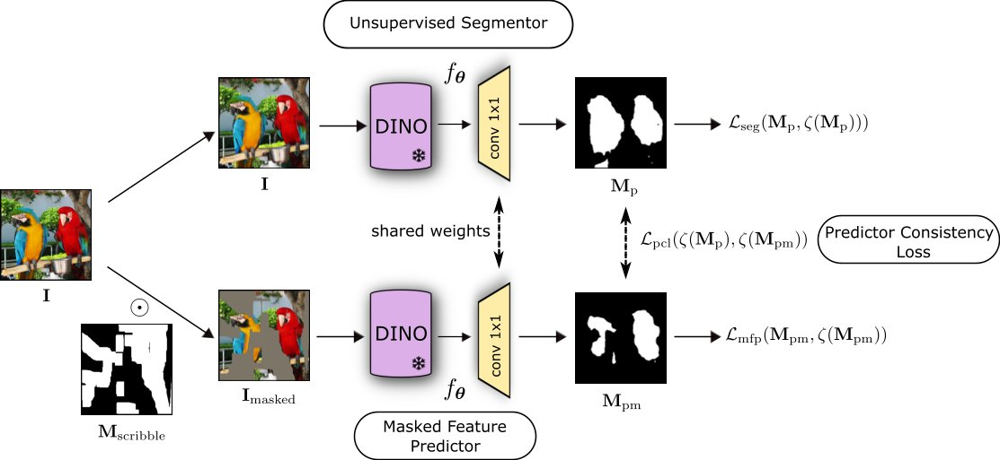
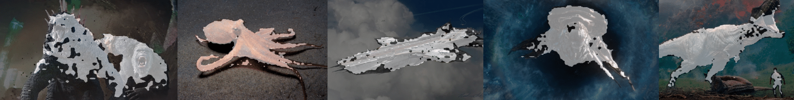

# Peekaboo

**Concordia University**

Hasib Zunair, A. Ben Hamza

[[`Paper`](https://arxiv.org/abs/2407.17628)] [[`Project`](https://hasibzunair.github.io/peekaboo/)] [[`Demo`](#4-demo)] [[`BibTeX`](#5-citation)]

This is official code for our **BMVC 2024 paper**:<br>
[PEEKABOO: Hiding Parts of an Image for Unsupervised Object Localization](https://arxiv.org/abs/2407.17628)
<br>



A segmentation model with zero-shot generalization to unfamiliar images and objects that are small, reflective or under poor illumination without the need for additional training. Our approach aims to explicitly model contextual relationship among pixels in a self-supervised procedure through image masking for unsupervised object localization.



## 1. Specification of dependencies

This code requires Python 3.8 and CUDA 11.2. Clone the project repository, then create and activate the following conda envrionment.

```bash
# clone repo
git clone https://github.com/hasibzunair/peekaboo
cd peekaboo
# create env
conda update conda
conda env create -f environment.yml
conda activate peekaboo
```

Or, you can also create a fresh environment and install the project requirements inside that environment by:

```bash
# clone repo
git clone https://github.com/hasibzunair/peekaboo
cd peekaboo
# create fresh env
conda create -n peekaboo python=3.8     
conda activate peekaboo
# example of pytorch installation
pip install torch===1.8.1 torchvision==0.9.1 -f https://download.pytorch.org/whl/torch_stable.html
pip install pycocotools
# install dependencies
pip install -r requirements.txt
```

## 2a. Training code

### Dataset details

We train Peekaboo on only the images of [DUTS-TR](http://saliencydetection.net/duts/) dataset without any labels, since Peekaboo is self-supervised. Download it, then create a directory inside the project folder named `datasets_local` and put it there.

We evaluate on two tasks: unsupervised saliency detection and single object discovery. Since our method is used in an unsupervised setting, it does not require training or fine-tuning on the datasets we evaluate on.

#### Unsupervised Saliency Detection

We use the following datasets:

- [DUT-OMRON](http://saliencydetection.net/dut-omron/)
- [DUTS-TEST](http://saliencydetection.net/duts/)
- [ECSSD](https://www.cse.cuhk.edu.hk/leojia/projects/hsaliency/dataset.html)

Download the datasets and keep them in `datasets_local`.

#### Single Object Discovery

For single object discovery, we follow the framework used in [LOST](https://github.com/valeoai/LOST). Download the datasets and put them in the folder `datasets_local`.

- [VOC07](http://host.robots.ox.ac.uk/pascal/VOC/)
- [VOC12](http://host.robots.ox.ac.uk/pascal/VOC/)
- [COCO20k](https://cocodataset.org/#home)

Finally, download the masks of random streaks and holes of arbitrary shapes from [SCRIBBLES.zip](https://github.com/hasibzunair/masksup-segmentation/releases/download/v1.0/SCRIBBLES.zip) and put it inside `datasets` folder.

### DUTS-TR training

```bash
export DATASET_DIR=datasets_local # root directory training and evaluation datasets

python train.py --exp-name peekaboo --dataset-dir $DATASET_DIR
```

See logs in `outputs/peekaboo-DUTS-TR-vit_small8` folder and also see tensorboard logs by running: `tensorboard --logdir=outputs`.

## 2b. Evaluation code

After training, the model checkpoint and logs are available in `peekaboo-DUTS-TR-vit_small8` in the `outputs` folder. Set the model path for evaluation.

```bash
export MODEL="outputs/peekaboo-DUTS-TR-vit_small8/decoder_weights_niter500.pt"
```

### Unsupervised saliency detection eval

```bash
# run evaluation
source evaluate_saliency.sh $MODEL $DATASET_DIR single
source evaluate_saliency.sh $MODEL $DATASET_DIR multi
```

### Single object discovery eval

```bash
# run evalulation
source evaluate_uod.sh $MODEL $DATASET_DIR
```

All experiments are conducted on a single NVIDIA 3080Ti GPU. For additional implementation details and results, please refer to the supplementary materials section in the paper.

## 3. Pre-trained models

We provide pretrained models on [./data/weights/](./data/weights/) for reproducibility. Here are the main results of Peekaboo on single object discovery task. For results on unsupervised saliency detection task, we refer readers to our paper!

|Dataset      | Backbone  |   CorLoc (%)  |   Download   |
|  ---------- | -------   |  ------ |  --------   |
| VOC07 | ViT-S/8  | 72.7 | [download](./data/weights/peekaboo_decoder_weights_niter500.pt) |
| VOC12 | ViT-S/8 | 75.9 | [download](./data/weights/peekaboo_decoder_weights_niter500.pt) |
| COCO20K | ViT-S/8 | 64.0 | [download](./data/weights/peekaboo_decoder_weights_niter500.pt) |

Additional pre-trained models of different configutations of Peekaboo can be found [here](https://github.com/hasibzunair/peekaboo/releases/tag/v1).

## 4. Demo

We provide prediction demos of our models. The following applies and visualizes our method on a single image.

```bash
# infer on one image
python demo.py
```

If you want to test on your own images, you can run following that builds a gradio app that serves predictions locally.

```bash
# run gradio app locally
python app.py
```

A web demo is available [here](https://huggingface.co/spaces/hasibzunair/peekaboo-demo).

## 5. Citation

```bibtex
 @inproceedings{zunair2024peekaboo,
    title={PEEKABOO: Hiding Parts of an Image for Unsupervised Object Localization},
    author={Zunair, Hasib and Hamza, A Ben},
    booktitle={Proc. British Machine Vision Conference},
    year={2024}
  }
```

## Project Notes

<details><summary>Click to view</summary>
<br>

**[Mar 18, 2024]** Infer on image folders.

```python
# infer on folder of images
python visualize_outputs.py --model-weights outputs/msl_a1.5_b1_g1_reg4-MSL-DUTS-TR-vit_small8/decoder_weights_niter500.pt --img-folder ./datasets_local/DUTS-TR/DUTS-TR-Image/ --output-dir outputs/visualizations/msl_masks
```

**[Nov 10, 2023]** Reproduced FOUND results.

**[Nov 10, 2023]** Added project notes section.

</details>

## Acknowledgements

This repository was built on top of [FOUND](https://github.com/valeoai/FOUND), [SelfMask](https://github.com/NoelShin/selfmask), [TokenCut](https://github.com/YangtaoWANG95/TokenCut) and [LOST](https://github.com/valeoai/LOST). Consider acknowledging these projects.
